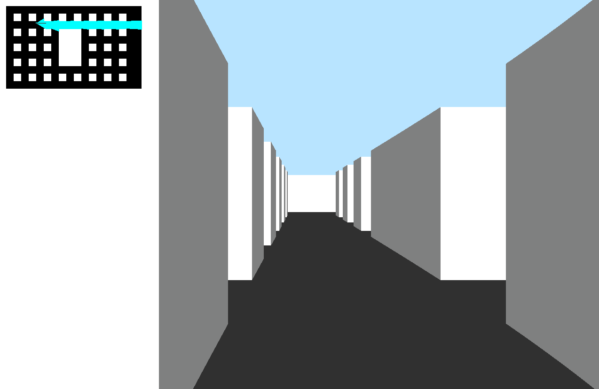

# Raycasting
Implementing a basic Raycasting renderer in C similiar to the [Wolfenstein 3D](https://github.com/id-Software/wolf3d) technique. 

# Caveat
Assumptions in my implementation:

* Walls are perpendicular with the floor
* Floor is flat
* Walls are made of cubes with the same size

As I'm using angles to represent orientation, I require expensive functions like sine, cosine and tangent. Therefore, this is not the fastest raycasting implementation. If you pursue performance, you shoud look into the famous [Lodev article](lodev.org/cgtutor/raycasting.html), that uses vectors (x,y) to represent orientation.

# Compilation
This project is built in C99 and it compiles perfectly with GCC. The project uses [SDL](https://www.libsdl.org/) to deal with pixels, keyboard, etc.

# Textures
I'm using some textures from [64x Textures and Overlays](https://opengameart.org/content/64x-textures-an-overlays) (License Creative Commons 1.0) and the library [uPNG](https://github.com/elanthis/upng) to read PNG files from disk.